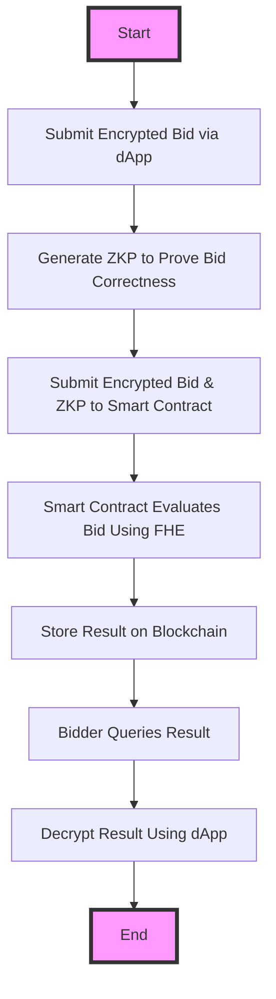

```mermaid
flowchart TD
    Start --> SubmitBid[Submit Encrypted Bid via dApp]
    SubmitBid --> GenerateZKP[Generate ZKP to Prove Bid Correctness]
    GenerateZKP --> SubmitEncryptedBidToContract[Submit Encrypted Bid & ZKP to Smart Contract]
    SubmitEncryptedBidToContract --> SmartContractEvaluatesBid[Smart Contract Evaluates Bid Using FHE]
    SmartContractEvaluatesBid --> ResultStored[Store Result on Blockchain]
    ResultStored --> BidderQueriesResult[Bidder Queries Result]
    BidderQueriesResult --> DecryptResult[Decrypt Result Using dApp]
    DecryptResult --> End

    style Start fill:#f9f,stroke:#333,stroke-width:4px
    style End fill:#f9f,stroke:#333,stroke-width:4px
```