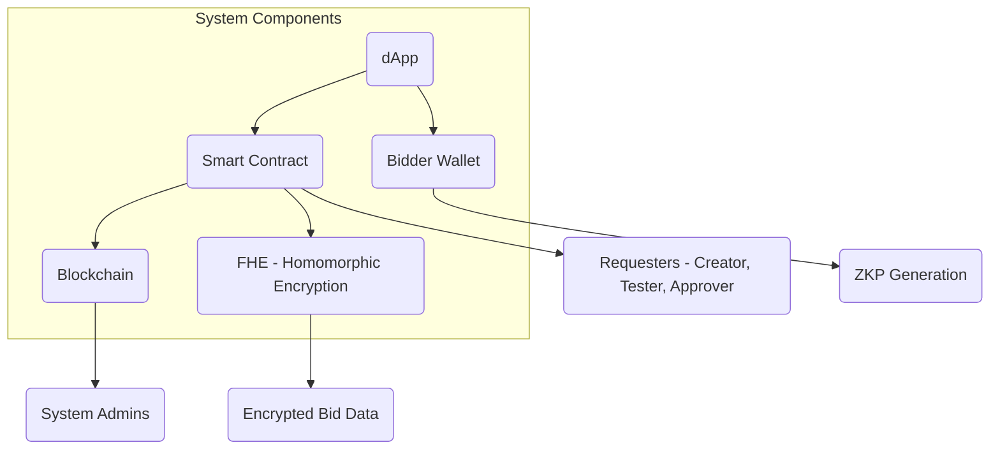

```mermaid
graph TD
    A(dApp) --> B(Smart Contract)
    A --> C(Bidder Wallet)
    B --> D(Blockchain)
    B --> E(FHE - Homomorphic Encryption)
    C --> F(ZKP Generation)
    E --> G(Encrypted Bid Data)
    D --> H(System Admins)
    B --> I(Requesters - Creator, Tester, Approver)

    subgraph System Components
        A
        B
        C
        E
        D
    end
```