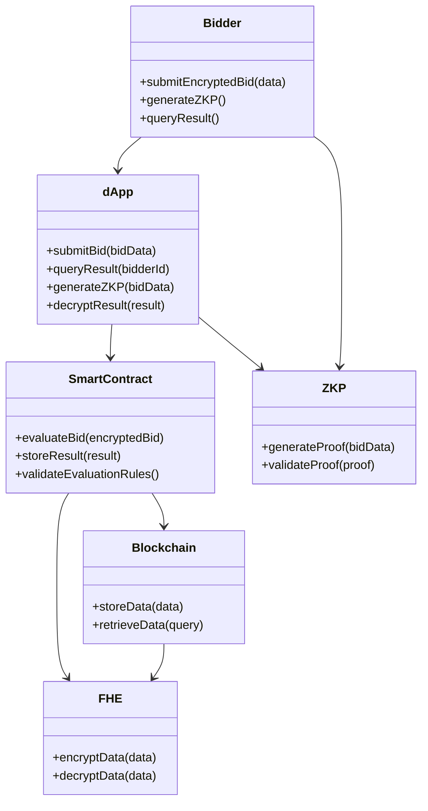

```mermaid
classDiagram
    class dApp {
        +submitBid(bidData)
        +queryResult(bidderId)
        +generateZKP(bidData)
        +decryptResult(result)
    }

    class SmartContract {
        +evaluateBid(encryptedBid)
        +storeResult(result)
        +validateEvaluationRules()
    }

    class Bidder {
        +submitEncryptedBid(data)
        +generateZKP()
        +queryResult()
    }

    class Blockchain {
        +storeData(data)
        +retrieveData(query)
    }

    class ZKP {
        +generateProof(bidData)
        +validateProof(proof)
    }

    class FHE {
        +encryptData(data)
        +decryptData(data)
    }

    dApp --> SmartContract
    dApp --> ZKP
    SmartContract --> Blockchain
    SmartContract --> FHE
    Bidder --> dApp
    Bidder --> ZKP
    Blockchain --> FHE

```