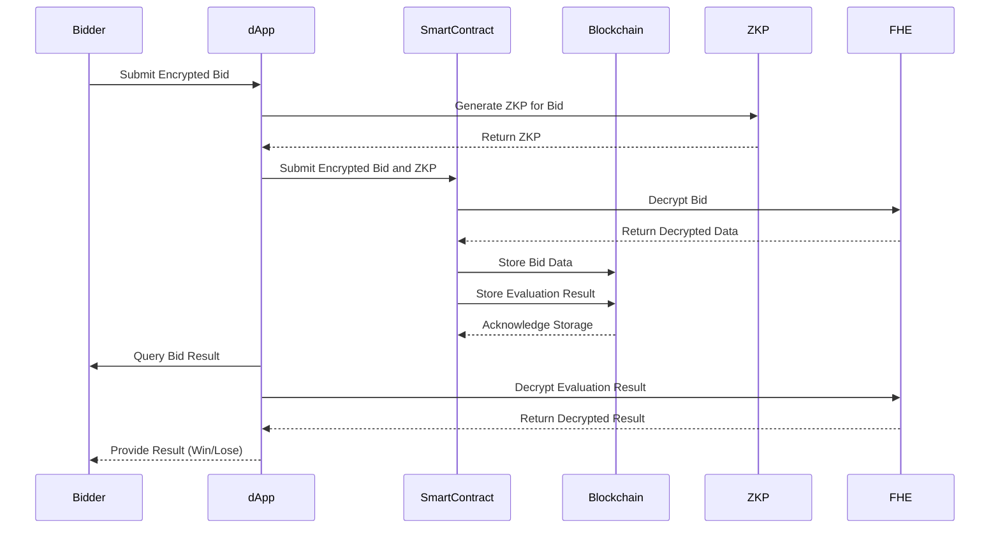

```mermaid
sequenceDiagram
    participant Bidder
    participant dApp
    participant SmartContract
    participant Blockchain
    participant ZKP
    participant FHE

    Bidder ->> dApp: Submit Encrypted Bid
    dApp ->> ZKP: Generate ZKP for Bid
    ZKP -->> dApp: Return ZKP
    dApp ->> SmartContract: Submit Encrypted Bid and ZKP
    SmartContract ->> FHE: Decrypt Bid
    FHE -->> SmartContract: Return Decrypted Data
    SmartContract ->> Blockchain: Store Bid Data
    SmartContract ->> Blockchain: Store Evaluation Result
    Blockchain -->> SmartContract: Acknowledge Storage
    dApp ->> Bidder: Query Bid Result
    dApp ->> FHE: Decrypt Evaluation Result
    FHE -->> dApp: Return Decrypted Result
    dApp -->> Bidder: Provide Result (Win/Lose)

```