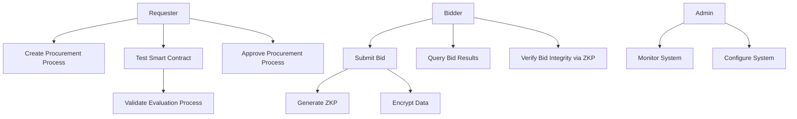

```mermaid
flowchart TD
    R[Requester] --> UC1[Create Procurement Process]
    R --> UC2[Test Smart Contract]
    R --> UC3[Approve Procurement Process]
    B[Bidder] --> UC4[Submit Bid]
    B --> UC5[Query Bid Results]
    A[Admin] --> UC6[Monitor System]
    A --> UC7[Configure System]
    B --> UC8[Verify Bid Integrity via ZKP]
    UC4 --> UC9[Generate ZKP]
    UC4 --> UC10[Encrypt Data]
    UC2 --> UC11[Validate Evaluation Process]

```